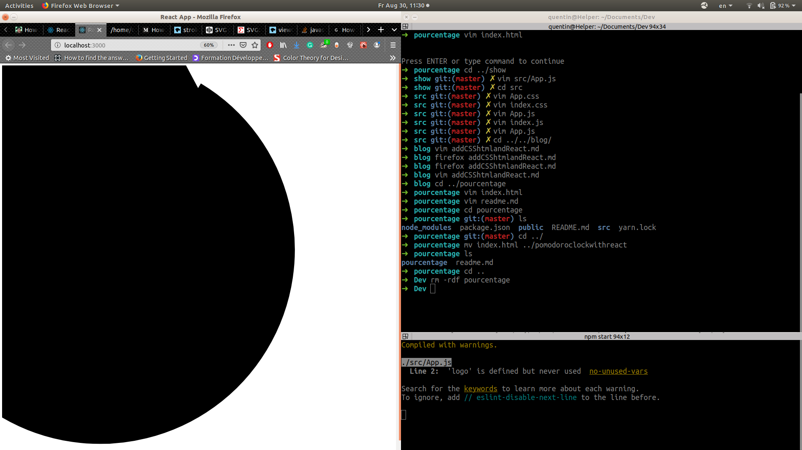

# Rebuild the pomodoro clock

I want to build a new and better pomodoro clock.

## Logs
_30.08.2019_: How to use an arc that represents the countdown.

- I want to use this ["CSS&HTML based Recipe for an progress chart"](https://medium.com/@pppped/how-to-code-a-responsive-circular-percentage-chart-with-svg-and-css-3632f8cd7705)
This is working with plain HTML but whenever I am implementing this code in React nothing is working. I cannot change the percentage and the fill attribute of the arc is errored. As you can see in the picture.

- I discover an [interactive Circle Arc simulator](http://xahlee.info/js/svg_circle_arc.html). This helped me to see how to build a correct arc. I look like it is possible to build it with React. It is nevertheless complicated. I would like to find another solution.

- Another solution is to [use d3 and React for building the progress chart](http://www.adeveloperdiary.com/react-js/integrate-react-and-d3/). But again it looks like there are simpler solutions. **I NEED TO DIG INTO http://www.adeveloperdiary.com/**

- The simplest solution is for me to inspire myself of (ReactCircle - Render a sgv circle + progress)[https://reactjsexample.com/renders-a-svg-circle-progress/] and to play with the (stroke-dasharray attribute)[https://developer.mozilla.org/fr/docs/Web/SVG/Attribute/stroke-dasharray] in react. I quickly tryed it on react and it seems to work. Here are the [properties of SVG circles](https://www.w3schools.com/graphics/svg_circle.asp).

_31.08.2019_:  the progress chart is moving with react
- I used the accurateInterval and the state of react to decrement the circle of a shroke dash every 50 millisecond.

_01.08.2019_: Add the button reset
- Add the button reset that should restart the countdown.

_05.08.2019_: timer stops at 0 && right behavior for the reset button
- The timer stopped when it reaches 0. then the circle and the state's values reboot.
- The botton "reset" now stop the timer and reboot all the state's values.

## Questions

30.08.2019:
	- **Why is the arc of the first code(in a html file) displayed correctly and why has the second code(in a js file with react) a wrong representation?**

* First code:
`<html>
	
	<body>
		<svg viewBox="0 0 36 36">
			<path style="display:block; margin:10px auto; max-width:80%; max-height:250px;" stroke-dasharray="80, 20" d="M18 2.0845 a 15.9155 15.9155 0 0 1 0 31.831 a 15.9155 15.9155 0 0 1 0 -31.831" stroke-width="1" stroke="black"/>
		</svg>
		
	</body>
</html>`

* Second code:

`function App() {
  return (
	    <svg viewBox="0 0 36 36" class="circle">
  		<path d="M 18 2.0845
	  		A 15.9155 15.9155 0 0 1 0 31.831
	  		A 15.9155 15.9155 0 0 1 0 -31.831" stroke="black"/>
	  </svg>
  );
}
export default App;`

	- **What is a TSX file?**
It is a typescript file, in which jsx is incorporated.
	
	- **What is the viewBox?**
* In a svg tag, the attribute viewBox defines the position and dimension, in user space of an SVG viewport[(As mentioned here)](https://developer.mozilla.org/en-US/docs/Web/SVG/Attribute/viewBox). This is for me still unclear... A better explanation comes from [lifewire](https://www.lifewire.com/svg-viewbox-attribute-3469829). They say that viewBox acts like it crops an image of a svg and scale it to the size of the SVG canva.

* ViewBox has four arguments: viewBox(min-x min-y width height):
Min-x is the x coordonate from where the cropping will start.
Min-y is the y coordonate from where the cropping will start.
Width is the width length that the cropping need to take into account.
Height is the height length that the cropping need to take into account.

* Let build a simple SVG with a black circle(with a diameter of 500px on a red squared canva of 500px:

`<svg width="500px" height="500px" style="background-color: red;">
	<circle cx="250" cy="250" r="250"/>
</svg>`

<svg width="500px" height="500px" style="background-color: red;">
	<circle cx="250" cy="250" r="250"/>
</svg>

by adding the viewBox we obtain:

`<svg viewBox="250 250 250 250" width="500px" height="500px" style="background-color:red;">
 <circle cx="250" cy="250" r="250"/>
</svg>`

<svg viewBox="250 250 250 250" width="500px" height="500px" style="background-color:red;">
 <circle cx="250" cy="250" r="250"/>
</svg>

